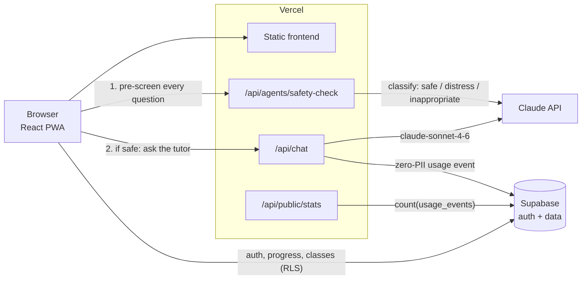

# 🌉 EduBridge — Free AI Tutor for Every Child

**A free, open-source AI tutor that gives underprivileged children in India a patient, kind teacher in their own language — powered by Claude.**


## Why

Millions of children in India grow up without access to a tutor: schools are overcrowded, private tuition is unaffordable, and learning material rarely exists in a child's mother tongue. EduBridge closes that gap with an AI tutor that explains things simply, never gets tired, never judges, and speaks 7 Indian languages — free, forever.

Built by **Chandrababu Anakapalli** for the **Anthropic Claude Corps Fellowship**.

## ✨ Features

- 💬 **AI tutoring chat** with conversation memory — follow-up questions just work
- 🌍 **7 languages** — English, Hindi, Telugu, Tamil, Kannada, Bengali, Marathi
- 📚 **NCERT-aligned** — pick your class (1–12) and chapter; answers follow the Indian curriculum
- 🎂 **Age-appropriate answers** — Little Kids (6–10) and Older Kids (11–14) modes
- 🛡️ **Child-safety pipeline** — every message is pre-screened before it reaches the tutor (see [Safety](#%EF%B8%8F-child-safety))
- 🎮 **Gamification** — XP, levels, badges, streaks, and confetti to keep learning joyful
- 🧑‍🏫 **Teacher platform** — create classes, share join codes, track student progress on a dashboard
- 🔊 **Read aloud & voice input** — for early readers, via built-in browser speech APIs
- 📱 **PWA / offline-ready** — installable on low-end Android phones
- 📊 **Zero-PII analytics** — impact numbers without ever storing what a child asked
- 🔒 **Hardened by default** — input allowlists, rate limiting, RLS-locked database, security headers

## 🏗️ Architecture

Production is a **single Vercel project**: the static frontend and the serverless API deploy together from `frontend/`. Supabase provides auth, teacher/student data, and analytics. The Express server in `backend/` is for local development and the eval harness only.



## 🛠️ Tech Stack

| Layer | Technology |
|---|---|
| Frontend | React 18, Vite, Tailwind CSS, framer-motion, `vite-plugin-pwa` |
| API (production) | Vercel Serverless Functions (`frontend/api/`) |
| AI | Claude API — `claude-sonnet-4-6` (tutor), `claude-haiku-4-5` (safety classifier) |
| Auth & database | Supabase (Postgres + Row Level Security) |
| Local backend | Node.js + Express (`backend/`, dev/eval only) |
| Testing | Vitest, Testing Library, Supertest, Playwright |
| CI/CD | GitHub Actions → Vercel |

## 🏃 Getting Started

**Prerequisites:** Node.js 20+ and npm.

### Quick start (zero config)

```bash
git clone https://github.com/chandrababu2048-cell/EduBridge.git
cd EduBridge/frontend
npm install
npm run dev          # http://localhost:5173
```

Guest mode works with no environment variables at all — browse the app, subjects, and gamification. To get real AI answers locally, run the Express backend too:

```bash
cd backend
npm install
cp .env.example .env   # paste your Anthropic API key
npm run dev            # http://localhost:3001
```

### Environment variables

Each app has a documented `.env.example` ([frontend](frontend/.env.example), [backend](backend/.env.example)):

| Variable | Where | What breaks without it |
|---|---|---|
| `ANTHROPIC_API_KEY` | backend `.env` / Vercel | No AI answers — chat returns errors |
| `VITE_API_URL` | frontend `.env` (local only) | Frontend can't reach the local Express API |
| `VITE_SUPABASE_URL` + `VITE_SUPABASE_ANON_KEY` | frontend `.env` / Vercel | No sign-in, no saved progress, no teacher platform (guest mode still works) |
| `SUPABASE_URL` + `SUPABASE_SERVICE_ROLE_KEY` | Vercel (server-side only) | Usage analytics silently disabled; landing-page stats show fallback numbers |
| `ALLOWED_ORIGIN` | backend `.env` | CORS blocks a non-localhost frontend from calling the Express API |

The service-role key bypasses RLS — keep it server-side, never give it a `VITE_` prefix, never commit it.

## 🧪 Testing

**147 automated tests** run on every push via [GitHub Actions](.github/workflows/ci.yml) — no secrets required (external services are stubbed).

```bash
cd frontend && npm test          # 65 unit tests (Vitest + Testing Library)
cd backend  && npm test          # 77 API/validation/safety tests (Vitest + Supertest)
cd frontend && npm run test:e2e  # 5 Playwright smoke tests against the production build
cd backend  && npm run eval      # optional: answer-quality eval (needs a real API key)
```

## ☁️ Deployment

1. Import the repo on [vercel.com](https://vercel.com) → **Add New → Project**, set **Root Directory** to **`frontend`**.
2. Add environment variables: `ANTHROPIC_API_KEY`, `VITE_SUPABASE_URL`, `VITE_SUPABASE_ANON_KEY`, `SUPABASE_URL`, `SUPABASE_SERVICE_ROLE_KEY`.
3. Apply the migrations to your Supabase project — run each file in `backend/supabase/migrations/` (001 → 002 → 003), in order, in the Supabase **SQL Editor**.
4. Deploy. Verify with `https://<your-app>.vercel.app/api/health`.

Click-by-click instructions live in [`DEPLOY.md`](./DEPLOY.md); day-2 operations in [`RUNBOOK.md`](./RUNBOOK.md); classroom usage in [`NGO_GUIDE.md`](./NGO_GUIDE.md).

## 📁 Project Structure

```
EduBridge/
├── frontend/
│   ├── api/            # Vercel serverless functions (PRODUCTION API)
│   │   ├── _lib/       # canonical shared logic: prompts, validation, safety, analytics
│   │   ├── agents/     # safety-check pre-screen endpoint
│   │   ├── chat.js     # main tutoring endpoint
│   │   └── ...         # health, stats
│   ├── src/            # React app (components, pages, hooks, contexts, NCERT data)
│   ├── e2e/            # Playwright smoke tests
│   └── vercel.json     # SPA rewrites + security headers
├── backend/
│   ├── server.js       # Express server (local dev / eval only)
│   ├── supabase/
│   │   └── migrations/ # 001 teacher/student · 002 RLS hardening · 003 usage analytics
│   └── eval/           # answer-quality evaluation harness
├── shared/             # re-exports frontend/api/_lib for the backend (single source of truth)
└── .github/workflows/  # CI: frontend, backend, and E2E jobs
```

## 🛡️ Child Safety

Safety is a first-class feature, not an afterthought:

- **Pre-screening.** Every message is classified by a fast Claude model *before* it reaches the tutor: `safe`, `distress`, or `inappropriate`.
- **Distress response.** If a child may be signalling abuse, danger, self-harm, or crisis, the app responds with a caring message and India's **Childline 1098** helpline.
- **Inappropriate content** (jailbreaks, adult requests) gets a gentle redirect back to learning — never a scary error.
- **Fail-open by design.** A safety-monitor outage never blocks a learning question.
- **Prompt-injection resistant.** User text is never interpolated into system prompts; subjects, languages, and grades are strictly allowlisted; classifier output is allowlisted too.
- **Zero PII.** Analytics stores only coarse dimensions (subject/age band/language/grade) — never message content, names, IPs, or IDs. The `usage_events` table has RLS enabled with zero policies: unreachable from the browser.
- **Cost & abuse protection.** Per-IP rate limiting (20 req/min), message-length caps, and strict security headers.

## 💙 Credits & License

Built by **Chandrababu Anakapalli** — years of teaching orphaned children in India with zero resources led to this: a patient, kind tutor for every child, free, forever.

Released under the [MIT License](./LICENSE).
